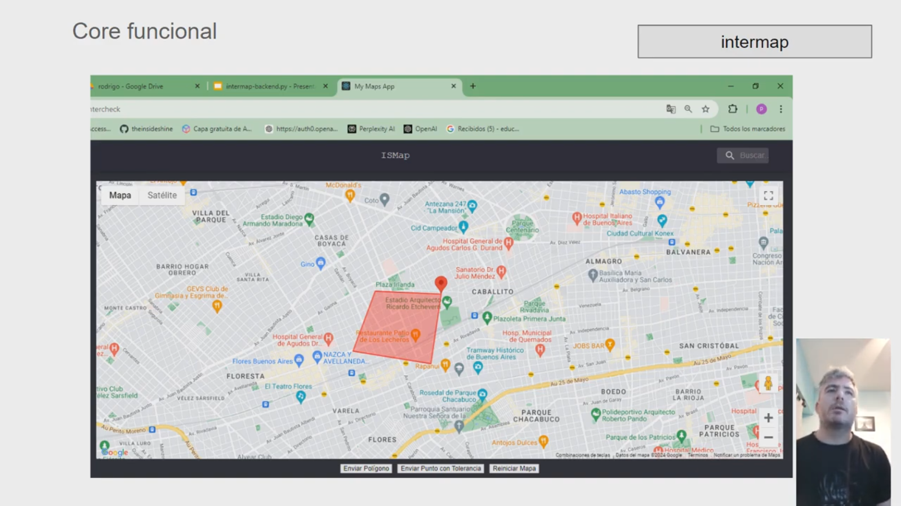

App to detect geographic interference

The intention of the project is to be able to test the concept of an app that, when entering a position on the map, determines if it interferes with a network of high-tension power cables.

Core

Frontend-React : https://github.com/theinsideshine/is-intermap-app

